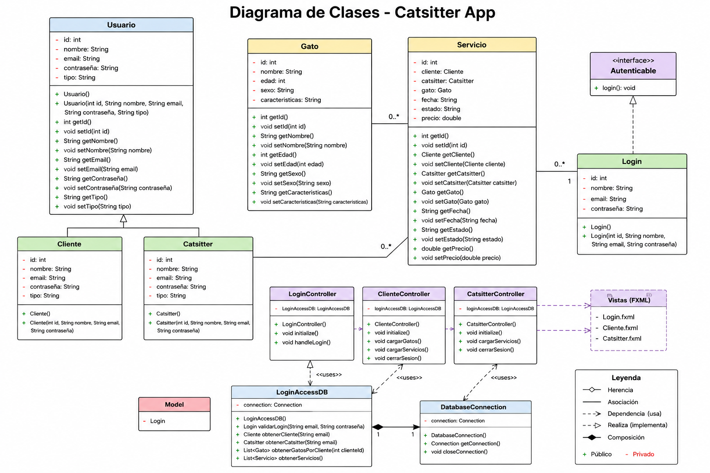
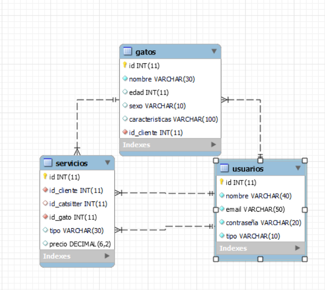
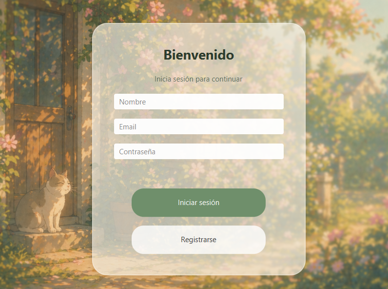
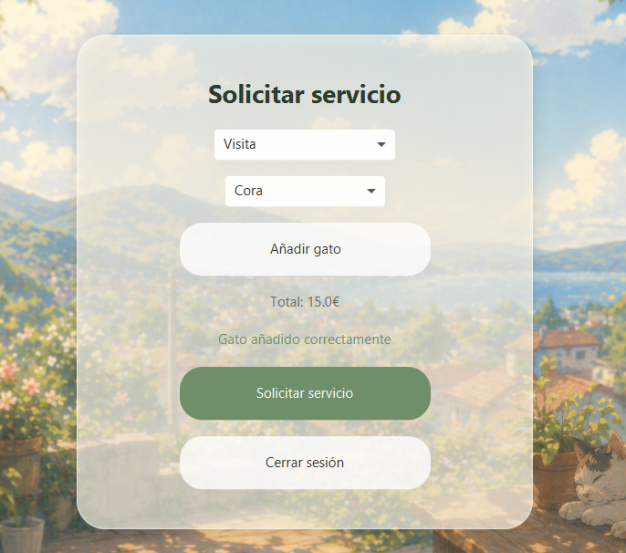
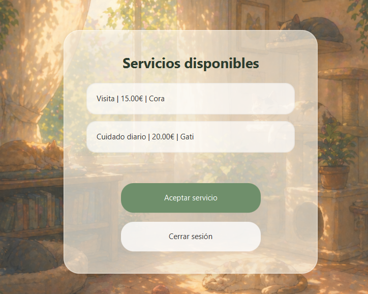

# Catsitter App

## 1. Descripción del proyecto

Catsitter App es una aplicación desarrollada en JavaFX conectada a MySQL, cuyo objetivo es gestionar servicios de cuidado de gatos.

La aplicación cuenta con dos tipos de usuarios:

- Cliente: puede registrar gatos y solicitar servicios de cuidado.
- Catsitter: puede visualizar servicios pendientes, aceptarlos y generar una factura básica.

Este proyecto ha sido desarrollado como práctica del módulo de Programación del ciclo formativo de Desarrollo de Aplicaciones Multiplataforma (DAM).

---

## 2. Tecnologías utilizadas

Para el desarrollo del proyecto se han utilizado las siguientes tecnologías:

- Java
- JavaFX
- MySQL
- JDBC
- CSS
- Scene Builder

---

## 3. Estructura del código

El proyecto está organizado en diferentes paquetes para separar responsabilidades y mejorar la organización del código.

### app

Este paquete contiene las clases principales del modelo de la aplicación.

- `Usuario.java` → Clase base de usuarios.
- `Cliente.java` → Hereda de Usuario y representa al cliente.
- `Catsitter.java` → Hereda de Usuario y representa al catsitter.
- `Gato.java` → Representa los gatos registrados.
- `Servicio.java` → Representa los servicios solicitados.
- `Autenticable.java` → Interfaz utilizada para la autenticación.
- `Main.java` → Punto de entrada de la aplicación.

### controller

Este paquete contiene los controladores de JavaFX encargados de gestionar la lógica de cada interfaz.

- `LoginController.java` → Gestiona el inicio de sesión y el cambio entre pantallas.
- `ClienteController.java` → Gestiona la lógica de cliente, registro de gatos y solicitud de servicios.
- `CatsitterController.java` → Gestiona la visualización y aceptación de servicios.

### model

- `Login.java` → Clase relacionada con el proceso de autenticación.

### mysql

- `LoginAccessDB.java` → Contiene las consultas SQL y la comunicación con la base de datos.

### util

- `DatabaseConnection.java` → Gestiona la conexión con MySQL y la creación de la base de datos.

### resources

#### fxml

Contiene las interfaces gráficas de la aplicación:

- `Login.fxml`
- `Cliente.fxml`
- `Catsitter.fxml`

#### css

- `style.css` → Contiene los estilos visuales de la aplicación.

#### images

Contiene las imágenes utilizadas en la interfaz.

---

## 4. Diagrama de clases

A continuación se muestra el diagrama de clases utilizado en el proyecto:

---

## 5. Modelo entidad-relación de la base de datos

El proyecto utiliza una base de datos relacional compuesta por varias tablas conectadas entre sí.

Las tablas principales son:

- `usuarios`
- `gatos`
- `servicios`

Las relaciones entre tablas se realizan mediante claves foráneas para asociar clientes, gatos y servicios.

---

## 6. Manual de usuario

### Pantalla de inicio de sesión

En esta pantalla el usuario puede iniciar sesión introduciendo el correo electrónico y la contraseña.

Dependiendo del tipo de usuario que acceda, la aplicación mostrará una interfaz distinta.

---

### Pantalla cliente

La interfaz de cliente permite:

- Seleccionar gatos registrados.
- Añadir nuevos gatos.
- Seleccionar un servicio.
- Solicitar servicios de cuidado.

El precio se actualiza automáticamente según el servicio seleccionado.

---

### Pantalla catsitter

La interfaz del catsitter permite:

- Visualizar servicios pendientes.
- Seleccionar un servicio.
- Aceptar solicitudes.

Cuando un servicio es aceptado, se genera una factura básica en formato `.txt`.

---

## 7. Ejecución del proyecto

Para ejecutar el proyecto es necesario:

1. Tener instalado Java.
2. Configurar JavaFX.
3. Tener MySQL instalado y funcionando.
4. Ejecutar la aplicación desde `Main.java`.

---

## 8. Autoría

Proyecto realizado por **Angélica Zuluaga Hincapié** para el módulo de **Programación** del ciclo formativo de **Desarrollo de Aplicaciones Multiplataforma (DAM)**.
